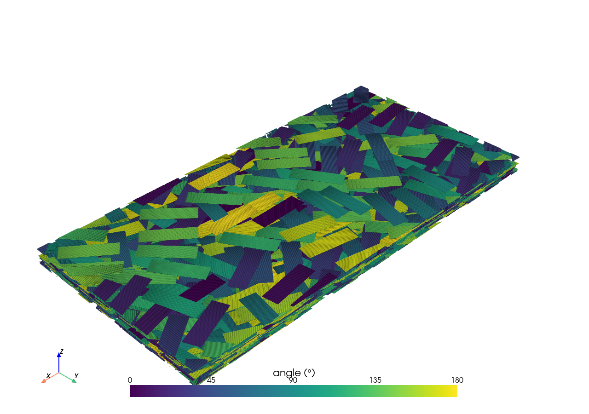
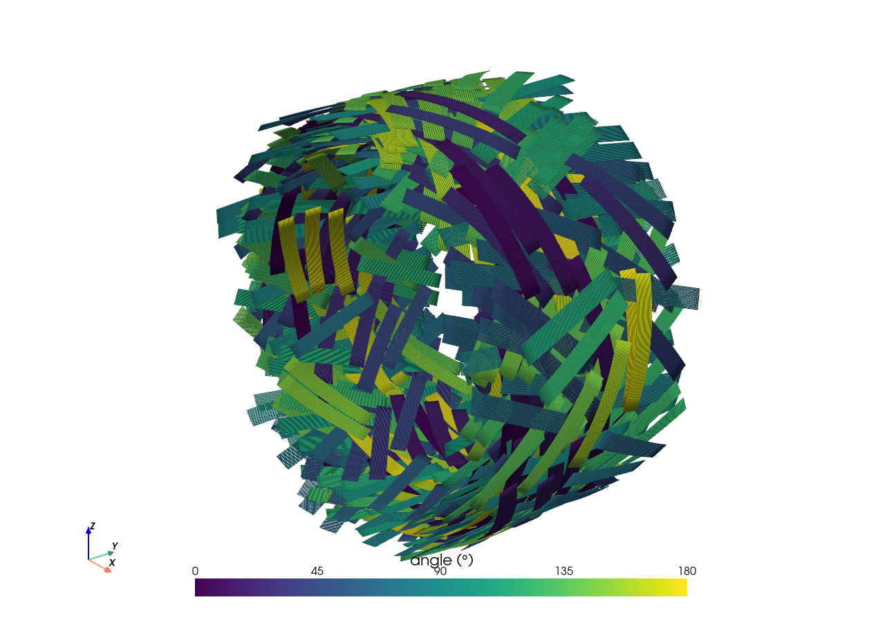

# Welcome to FiberMat’s documentation!

<a href="https://github.com/fmahe/fibermat">
    
</a>

[](https://pypi.org/project/fibermat/)
[](https://github.com/fmahe/fibermat)
[](https://fibermat.readthedocs.io/en/latest/)
[](https://opensource.org/licenses/MIT)
[](https://img.shields.io/badge/francois.mahe@ens--rennes.fr-Univ%20Rennes,%20ENS%20Rennes,%20CNRS,%20IPR%20--%20UMR%206251,%20F--35000%20Rennes,%20France-royalblue)
[](mailto:francois.mahe@ens-rennes.fr)

<details>
<summary>
<b> License </b> <a id="license"></a>

</summary>

```
                                        ██╖
████████╖  ████┐  ████╖       ██╖      ██╓╜
██╔═════╝  ██╔██ ██╔██║       ██║    ██████╖
█████─╖    ██║ ███╓╜██║██████╖██████╖██║ ██║
██╔═══╝    ██║ ╘══╝ ██║██║ ██║██╓─██║██╟───╜
██║    ██┐ ██║      ██║███ ██║██║ ██║│█████╖
╚═╝    └─┘ ╚═╝      ╚═╝╚══╧══╝╚═╝ ╚═╝╘═════╝
 █████┐       █████┐       ██┐
██╔══██┐     ██╓──██┐      └─┘       █╖████╖
 ██╖ └─█████ └███ └─┘      ██╖██████╖██╔══█║
██╔╝  ██╔══██   ███╖ ████╖ ██║██║ ██║██║  └╜
│██████╓╜   ██████╓╜ ╚═══╝ ██║██████║██║
╘══════╝    ╘═════╝        ╚═╝██╔═══╝╚═╝
      Rennes                  ██║
                              ╚═╝
@author: François Mahé
@mail: francois.mahe@ens-rennes.fr
(Univ Rennes, ENS Rennes, CNRS, IPR - UMR 6251, F-35000 Rennes, France)

@project: FiberMat
@version: v1.0

License
-------
MIT License

Copyright (c) 2024 François Mahé

Permission is hereby granted, free of charge, to any person obtaining a copy
of this software and associated documentation files (the "Software"), to deal
in the Software without restriction, including without limitation the rights
to use, copy, modify, merge, publish, distribute, sublicense, and/or sell
copies of the Software, and to permit persons to whom the Software is
furnished to do so, subject to the following conditions:

The above copyright notice and this permission notice shall be included in all
copies or substantial portions of the Software.

THE SOFTWARE IS PROVIDED "AS IS", WITHOUT WARRANTY OF ANY KIND, EXPRESS OR
IMPLIED, INCLUDING BUT NOT LIMITED TO THE WARRANTIES OF MERCHANTABILITY,
FITNESS FOR A PARTICULAR PURPOSE AND NONINFRINGEMENT. IN NO EVENT SHALL THE
AUTHORS OR COPYRIGHT HOLDERS BE LIABLE FOR ANY CLAIM, DAMAGES OR OTHER
LIABILITY, WHETHER IN AN ACTION OF CONTRACT, TORT OR OTHERWISE, ARISING FROM,
OUT OF OR IN CONNECTION WITH THE SOFTWARE OR THE USE OR OTHER DEALINGS IN THE
SOFTWARE.

Description
-----------
A mechanical solver to simulate fiber packing and perform statistical analysis.

References
----------
Mahé, F. (2023). Statistical mechanical framework for discontinuous composites:
  application to the modeling of flow in SMC compression molding (Doctoral
  dissertation, École centrale de Nantes).

```
</details>

**FiberMat** is a mechanical solver to simulate fiber packing and perform statistical analysis. It generates realistic 3D fiber mesostructures and computes internal forces and deformations.

This code is the result of thesis work that can be found in:
> [Mahé, F. (2023). Statistical mechanical framework for discontinuous composites:
  application to the modeling of flow in SMC compression molding (Doctoral
  dissertation, École centrale de Nantes).](https://theses.hal.science/tel-04189271/)

## Installation

Requirements:


### Install the package with Pip

Run the following commands:
```shell
# Install `FiberMat`
pip install fibermat

# Try it out
python -c "import fibermat"

```

### Install the package in an Anaconda environment

1. Create a conda environment:
    ```shell
    # Create conda environment
    conda create -n fibermat python=3.11

    # Activate the environment
    conda activate fibermat

    # Optional
    pip install jupyter

    ```

2. Install FiberMat:
    ```shell
    # Install `FiberMat`
    pip install --upgrade fibermat

    # Try it out
    python -c "import fibermat"

    ```

3. To leave `fibermat` environment, run ``conda deactivate``.

### Directly from the sources

Clone the repository and run `pip` command:
```shell
# Clone the repository
git clone git@github.com:fmahe/fibermat.git
cd ./fibermat

# Install `FiberMat`
pip install --upgrade .

```

### Build the sources

FiberMat's documentation is created using [Sphinx](https://www.sphinx-doc.org/en/master/) [<sup>[1]</sup>](#note-1).

1. Clone the repository:
    ```shell
    # Clone the repository
    git clone git@github.com:fmahe/fibermat.git
    cd ./fibermat

    ```

2. Install dependencies required to compile documentation:

    - Install the packages listed in `requirements.txt` with Pip:
        ```shell
        # Install dependencies
        pip install -r requirements.txt

        ```

    - Alternatively, you can create a new environment that already meets the requirements:
        ```shell
        # Create an environment from the `environment.yml` file
        conda env create -n fibermat -f ./environment.yml

        # Activate the environment
        conda activate fibermat

        ```

3. Execute `./make` script:
    ```shell
    # Build the sources
    ./make --all

    ```

4. Test the library:
    ```shell
    pytest

    ```

<a id="note-1"> [1] </a> : Here a tutorial (fr) for Sphinx: [Introduction à Sphinx, un outil de documentation puissant](https://blog.flozz.fr/2020/09/07/introduction-a-sphinx-un-outil-de-documentation-puissant/).

## Documentation

See the tutorial in `jupyter-notebook.ipynb`.

## Example

```python
from fibermat import *

# Generate a set of fibers
mat = Mat(100, length=25., width=2., thickness=0.5, size=50., shear=1., tensile=2500.)
# Build the fiber network
net = Net(mat, periodic=True)
# Stack fibers
stack = Stack(net, threshold=10)
# Create the fiber mesh
mesh = Mesh(stack)

# Solve the mechanical packing problem
sol = solve(Model(mesh), packing=4.)

# Export as VTK
msh = vtk_mesh(
    mesh,
    sol.displacement(1),
    sol.rotation(1),
    sol.force(1),
    sol.torque(1),
)
msh.plot(scalars="force", cmap=plt.cm.twilight_shifted)
msh.save("outputs/msh.vtk")

```


## Pack an CF-SMC stack

Drop rectangular tows into a box, then split each tow into a row of touching round fibers. The fiber diameter is the tow thickness.

```python
from fibermat.pack import pack, subdivide, write_lines

tows = pack(
    box=(100.0, 50.0, 4.0),  # box length, width and height (mm)
    length=12.5,             # tow length (mm)
    width=4.0,               # tow width (mm)
    thickness=0.12,          # tow height (mm)
    section="rectangle",
    volume_fraction=0.5,
    seed=1,
)
fibers = subdivide(tows)

# Each fiber becomes 10 colinear line elements, written through meshio.
write_lines(fibers, "outputs/fibers.vtk", n=10)

# Bend that stack into a ring about the y-axis. The fibers follow the curve.
write_lines(fibers, "outputs/fibers_ring.vtk", n=10, roll=True, scale=3)

```

`box` is centered in the plane and stands on `z = 0`. The mat is periodic in the plane. `volume_fraction` is a cap: packing stops when another tow does not fit, and the fraction actually reached is stored in `tows.attrs["volume_fraction"]`. `subdivide` replaces each tow by `floor(width / thickness)` parallel fibers of diameter `thickness`. `write_lines` splits every fiber into `n` line elements (10 by default) that share their end nodes, and meshio chooses the file format from the path. `roll=True` bends that stack into a ring, as shown below.

The stack below uses those dimensions. Each tow is colored by its in-plane angle with the viridis colormap. A tow has no preferred direction, so 0° and 180° are the same orientation.



### Roll into a ring

`roll=True` bends the finished stack into a ring about the y-axis. The box length becomes the circumference of the mid-surface, so the radius is that length over 2π, and each fiber follows the curve. `scale` multiplies the radius. A scale of 3 on a short box covers only a third of a turn; lengthen the box by the same factor and leave `scale` at 1 to close the larger ring.

```python
ring = pack(
    box=(270.0, 35.0, 9.5),  # length equals the mid-surface circumference
    length=25.0,
    width=4.0,
    thickness=0.206,
    section="rectangle",
    volume_fraction=0.4,
    seed=2,
)
write_lines(subdivide(ring), "outputs/ring.vtk", n=10, roll=True)

```

The ring below is that stack. Color is still the in-plane angle of each tow before the roll, drawn with viridis.


